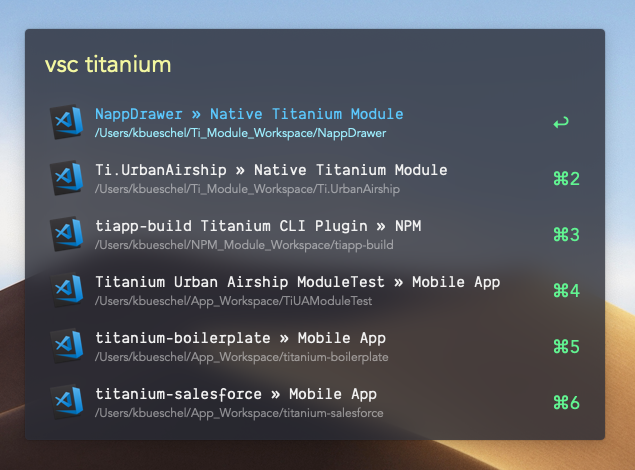

# alfred-vscode

> [Alfred 3](https://www.alfredapp.com) workflow that allows you to browse and open [Visual Studio Code](https://code.visualstudio.com/) projects or simply open specified folders/files.

[![Commitizen friendly][commitizen-badge]][commitizen]
[![dependencies][deps-badge]][deps]
[![version][version-badge]][package]
[![downloads][downloads-badge]][npmcharts]
[![downloads total][downloads-total-badge]][downloads-total]
[![MIT License][license-badge]][license]
[![Watch on GitHub][github-watch-badge]][github-watch]
[![Star on GitHub][github-star-badge]][github-star]



## Prerequisites

You need

- [Node.js 8+][node]
- [Alfred 3][alfred] with the paid [Powerpack][alfred-powerpack] upgrade
- [Visual Studio Code Project Manager][vscode-pm] - Only if you like to have a project manager for VS Code.
- [Visual Studio Code Command Line][vscode-cli]

## Installation

```bash
npm install --global alfred-vscode
```

**Note for Insiders Edition users:**

Remember to set the `vscodeEdition` variable to `code-insiders` in the Workflow Configuration!

It defaults to `code`.

## Usage

### Projects

Simply type `vsc` followed by space to list all projects. Optionally type a query to search for a
specific project or group. The overall list shows 100 projects at max.

Select a project and press <kbd>Enter</kbd> to open it in VS Code or Code Insiders.

Hold <kbd>Alt</kbd> when pressing <kbd>Enter</kbd> to open the project path in Terminal - You can set
the terminal app in the Workflow variables view.

Hold <kbd>Shift</kbd> when pressing <kbd>Enter</kbd> to open the project path in Finder.

### Folders / Files

Type `vs` followed by space and search for a specific folder or file to open in Visual Studio Code.

Hold <kbd>Shift</kbd> when pressing <kbd>Enter</kbd> to open that folder or file in a new VS Code window.

## Special Thanks

Big Thanks goes to [Cloudstek][cloudstek] for his [Alfred Atom Workflow][alfred-atom] which I used as a base for this project.

[commitizen-badge]: https://img.shields.io/badge/commitizen-friendly-brightgreen.svg
[commitizen]: https://commitizen.github.io/cz-cli
[deps-badge]: https://david-dm.org/kbshl/alfred-vscode.svg
[deps]: https://david-dm.org/kbshl/alfred-vscode
[version-badge]: https://img.shields.io/npm/v/alfred-vscode.svg
[package]: https://www.npmjs.com/package/alfred-vscode
[downloads-badge]: https://img.shields.io/npm/dm/alfred-vscode.svg
[npmcharts]: http://npmcharts.com/compare/alfred-vscode
[downloads-total-badge]: https://img.shields.io/npm/dt/alfred-vscode.svg
[downloads-total]: https://www.npmjs.com/package/alfred-vscode
[license-badge]: https://img.shields.io/npm/l/alfred-vscode.svg
[license]: https://github.com/kbshl/alfred-vscode/blob/master/LICENSE
[github-watch-badge]: https://img.shields.io/github/watchers/kbshl/alfred-vscode.svg?style=social
[github-watch]: https://github.com/kbshl/alfred-vsccode/watchers
[github-star-badge]: https://img.shields.io/github/stars/kbshl/alfred-vscode.svg?style=social
[github-star]: https://github.com/kbshl/alfred-vscode/stargazers
[alfred-theme]: https://github.com/michelegera/alfred-snazzy
[node]: https://nodejs.org
[cloudstek]: https://github.com/Cloudstek
[alfred-atom]: https://github.com/Cloudstek/alfred-atom
[alfred]: https://www.alfredapp.com
[alfred-powerpack]: https://www.alfredapp.com/powerpack
[vscode-cli]: https://code.visualstudio.com/docs/setup/mac
[vscode-pm]: https://marketplace.visualstudio.com/items?itemName=alefragnani.project-manager
